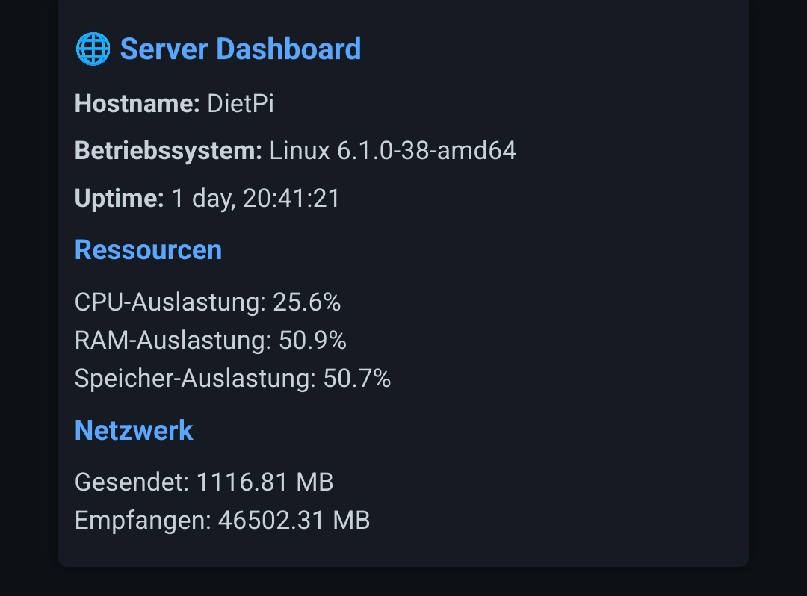

# 🖥️ Server Dashboard

Ein leichtgewichtiges Web-Dashboard für meinen Debian-Server, gebaut mit **Flask** und **psutil**.  
Es zeigt die wichtigsten Systeminformationen wie CPU-, RAM- und Festplattenauslastung, Hostname, Uptime und Netzwerk-Statistiken direkt im Browser an.  

---

## 🚀 Features
- Anzeige von **CPU-Auslastung, RAM & Festplattenplatz**  
- **Systeminformationen** wie Hostname, Betriebssystem und Uptime  
- **Netzwerk-Statistiken** (gesendete/empfangene Daten)  
- Einfach über den Browser erreichbar (`http://<server-ip>:5050`)  

---

## 📸 Screenshot

  

---

